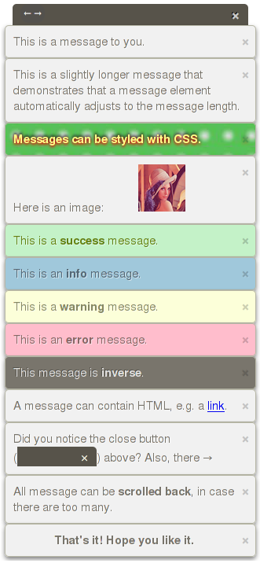
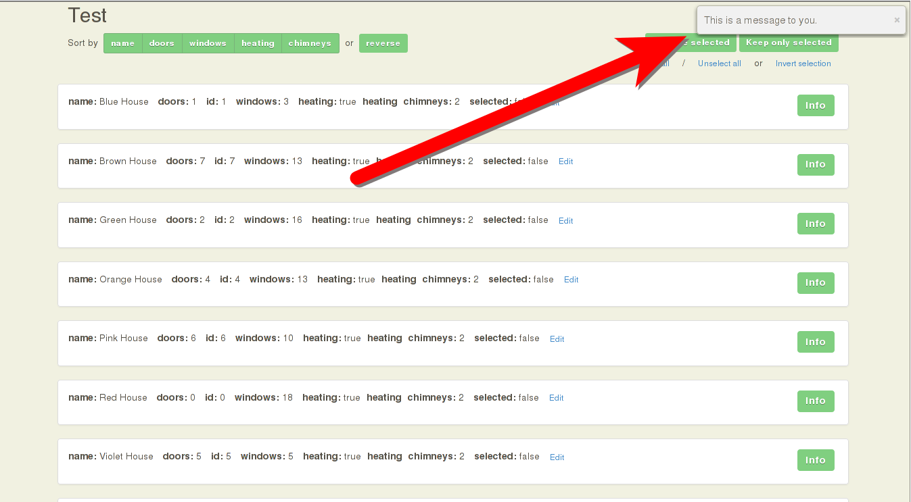

# Hermes

Hermes displays notification-like messages at the top right of your
website. This has been done before, but Hermes is a bit different:

- It works on mobile.
- There is no limit on the number of messages that can be displayed.
- A message can automatically be hidden after a configurable amout of time
  (or stay until the user closes it manually).
- Messages can contain arbitrary HTML (links, images/gifs/avatars, tables,
  lists, ...).
- Every message is 100% stylable with CSS.
- If the messages block the view, they can be moved to the other side of
  the screen.

For your convenience, Hermes automatically adds a scroll bar whenever there
are more messages than screen estate. A "Remove all" button appears at the
top as soon as there are more than 5 messages (and disappears again if
there are less than 6). Every message can be removed individually with its
own close button.

The fact that every message can contain arbitrary HTML and can be styled
using CSS means that you can make it have a certain class/id and use
JavaScript to interact with it (event handlers etc.).

**This is what a message looks like on a website:**

# Usage

1. Drop `hermes.js` into your project, e.g.:

        

2. Make a new `Hermes` object:

        var hermes = new Hermes('.main-content', true);

   `Hermes` takes a jQuery-like selector as an optional first argument.
   This is the point in the DOM where Hermes will *append* itself to the
   DOM. If no argument is specified, Hermes appends itself to the `html`
   element. `null` means "choose the default value".

   the second optional parameter indicates where the messages should be
   displayed. `true` means "on the left side of the screen", else messages
   will be shown on the right side of the screen. Default value: `false`
   (= "show messages on the right side").

3. Write a message to the screen:

        hermes.message("Glad to see you!");

# Interface

- hermes.**message**(*text*[, *css*[, *delay*]])

  Display *text* on the screen. This can either be a simple string or any
  valid HTML, like with jQuery's `.html()` method. If HTML rendering is not
  desired, *text* has to be HTML-escaped first.
  
  *css* is a hash of CSS key-value pairs just like jQuery's `.css()` method
  takes them. An empty hash can be provided and results in no custom styles
  being provided (just like leaving it out).

  *delay*
  is an integer indicating how long the message should be
  shown in milliseconds before being hidden (default value: `5000` = 5
  seconds). If `false` or `'never'`, the message will not be hidden
  automatically.

  Example:

        hermes.message('I am red and yellow and disappear after 2.5 seconds.', {
          'background-color': '#FF0000',
          'color': '#FFFF00',
        }, 2500)

- hermes.**success**(*text*[, *delay*])

  Display *text* as a green success message on the screen. *text* can
  either be a simple string or valid HTML.

  *delay* behaves just like with hermes.**success**(*text*[, *delay*]).

- hermes.**info**(*text*[, *delay*])

  Display *text* as a blue info message on the screen. *text* can either be
  a simple string or valid HTML.

  *delay* behaves just like with hermes.**success**(*text*[, *delay*]).

- hermes.**warning**(*text*[, *delay*])

  Display *text* as a yellow warning message on the screen. *text* can
  either be a simple string or valid HTML.

  *delay* behaves just like with hermes.**success**(*text*[, *delay*]).

- hermes.**error**(*text*[, *delay*])

  Display *text* as a red error message on the screen. *text* can either be
  a simple string or valid HTML.

  *delay* behaves just like with hermes.**success**(*text*[, *delay*]).

- hermes.**inverse**(*text*[, *delay*])

  Display *text* as a "white-on-black" message on the screen. The colors
  are roughly the inverse colors of a normal "black-on-white" message.
  *text* can either be a simple string or valid HTML.

  *delay* behaves just like with hermes.**success**(*text*[, *delay*]).

# Requirements

jQuery or any library with a jQuery-compatible interface.

# Styling/Behavior

The sky is the limit!

# What is it good for?

The use cases are vast:

- **Status updates**: "File has been uploaded", "Video has been
  processed successfully", ...
- **Gamification**: Display achievements.
- **User onboarding**: Sprinkle in help messages whenever necessary (more
  apparent than a tooltip).
- **Dialogs**: Less obtrusive than a real dialog/modal. **Tip**: The fact
  that a message can hold links, buttons etc. comes in handy here
  ("Ok"/"Cancel" buttons, input fields etc.).
- **Login**/**Signup**: Could include name/email and password fields etc.
- **Countdowns**: The `delay` parameter may help.
- **Feeds**: live-updates via AJAX/push
- **Streams**: Hermes can hold an arbitrary number of messages. So
  displaying logs in real-time is completely feasable. You can even
  programmatically remove messages if the number grows too large
  (messages can hold any elements which can have any arbitrary class/id).
- **Chat**: You can hook up a text input element to your chat API and
  potentially use Hermes as your chat component. This may come in handy
  during development when you do not want to deal with a proper front end
  yet.
- You know it when you see it. Feel free to extend this list!
